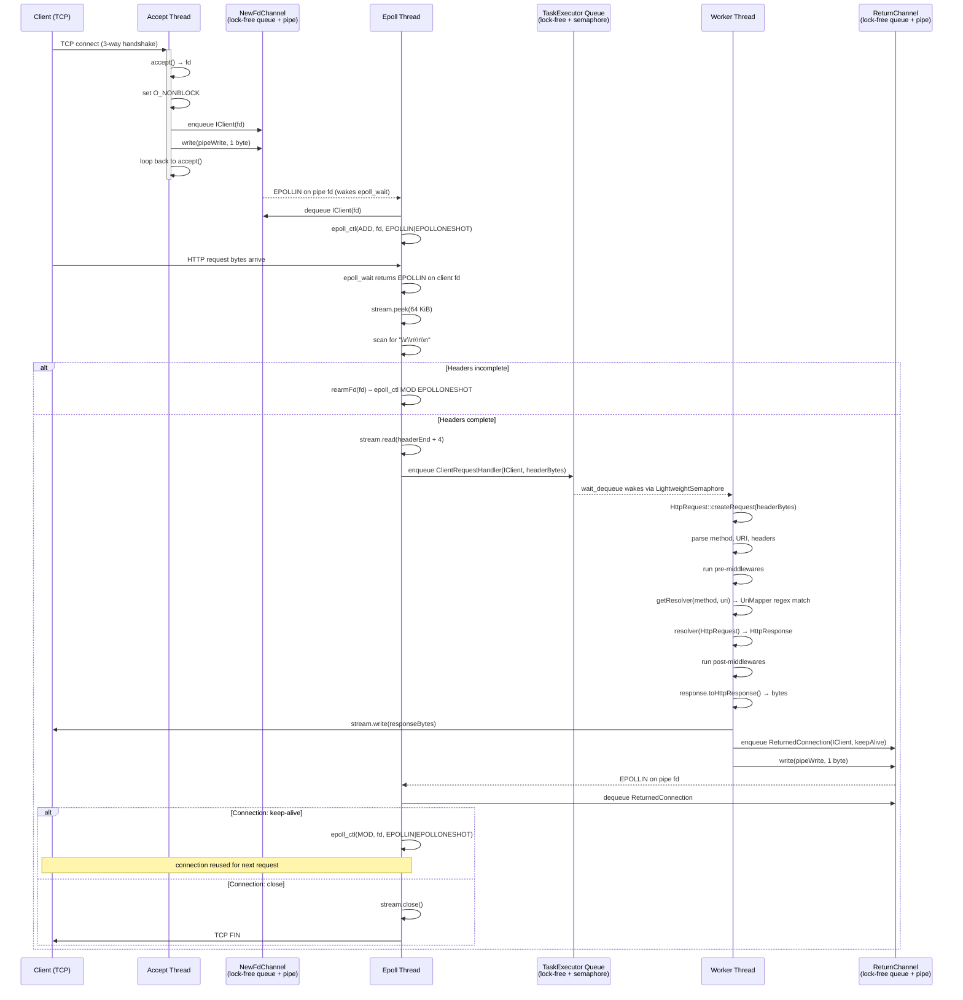
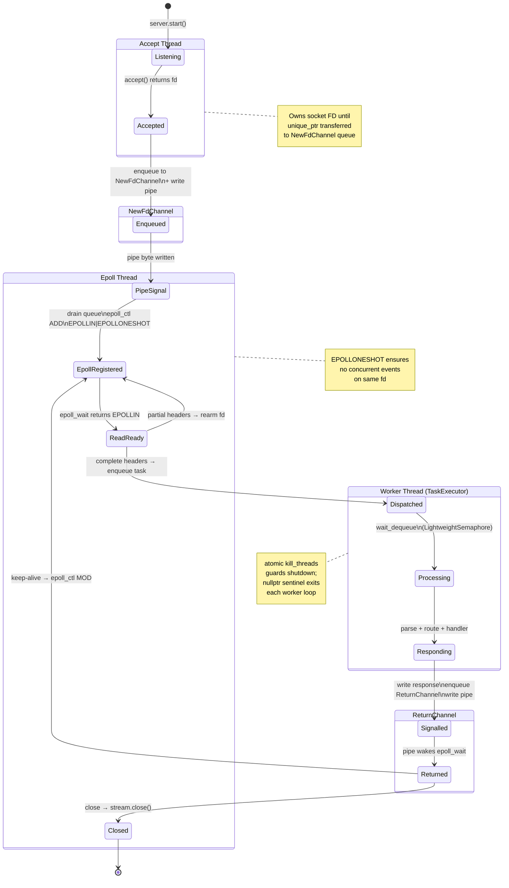
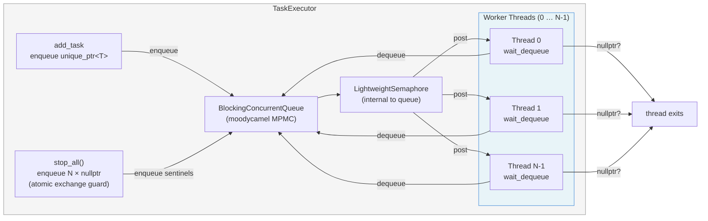

# Lightning++ Architecture

## Overview

Lightning++ is a high-performance, header-heavy C++ HTTP server library built around
three core design pillars: a **non-blocking I/O event loop** (epoll), a **lock-free
thread pool**, and **zero-copy IPC channels** between the threads that manage those
two subsystems. The result is a reactor-style server that can handle large numbers of
concurrent connections with minimal thread contention.

---

## Key Architectural Concepts

### 1 — Accept Thread (main thread)

The calling thread (the one that invokes `HttpServer::start()`) becomes the
**accept thread**. It runs a tight blocking loop around
`ILowLevelSocketServer::accept()`, which maps to the kernel `accept(4)` syscall on a
listening TCP socket. Each accepted file descriptor is:

1. Wrapped in an `IClient` concrete type (`PlainClient` or `SSLClient`).
2. Set to non-blocking mode with `O_NONBLOCK`.
3. **Enqueued** into `NewFdChannel::clients`
   — a lock-free `BlockingConcurrentQueue<unique_ptr<IClient>>`.
4. Signalled to the epoll thread by writing one byte to
   `NewFdChannel::pipeWrite`.

The accept thread never reads request data or writes responses; its only job is to
hand off new sockets as fast as possible.

### 2 — Epoll Thread

A single dedicated `std::thread` runs `NonblockingClientManagerTask::operator()()`.
This thread owns the `epoll(7)` instance and is the **only** thread that calls
`epoll_ctl` or `epoll_wait`. The event loop:

| Step | Action |
|------|--------|
| `epoll_wait()` | Blocks until one of: pipe byte, incoming data, or return-channel notification |
| Pipe read (newFdChannel) | Drains the `NewFdChannel` queue; registers each new fd with `EPOLLIN \| EPOLLONESHOT` |
| `EPOLLIN` on client fd | Peeks up to 64 KiB; scans for `\r\n\r\n`; on match extracts header bytes; dispatches `ClientRequestHandler` task to the worker pool |
| Partial headers | Re-arms fd with `EPOLLONESHOT` and waits for more data |
| Pipe read (returnChannel) | Drains the `ReturnChannel` queue; re-arms fd (`keep-alive`) or closes the connection |

**`EPOLLONESHOT`** is critical: once an fd fires, epoll removes interest in it
automatically, guaranteeing that no two threads ever process the same connection
simultaneously. The epoll thread re-arms the fd only when it is safe to do so.

### 3 — Worker Thread Pool (`TaskExecutor`)

`TaskExecutor<ClientRequestHandler>` is a lock-free MPMC thread pool:

- Backed by `moodycamel::BlockingConcurrentQueue<unique_ptr<ClientRequestHandler>>`.
- Worker threads block inside `wait_dequeue()`, which suspends on
  `moodycamel::LightweightSemaphore` — no `mutex`, no `sched_yield`.
- Shutdown uses a **null-pointer sentinel**: `stop_all()` enqueues one `nullptr`
  per worker; each worker exits when it dequeues `null`.
- Thread count is configurable at construction time (default: 1).

Each worker executes one `ClientRequestHandler::operator()()` per dequeue:

1. Parse HTTP request line and headers (`HttpRequest::createRequest`).
2. Match URI against registered routes (`UriMapper` regex matching).
3. Extract URI path parameters from regex capture groups.
4. Run pre-middlewares.
5. Call the user-registered `Resolver` function.
6. Run post-middlewares.
7. Serialize `HttpResponse` to raw bytes and write to the client socket stream.
8. Signal completion via `ReturnChannel`.

### 4 — Synchronization Primitives

| Primitive | Location | Purpose |
|-----------|----------|---------|
| `BlockingConcurrentQueue` (moodycamel) | `NewFdChannel::clients` | Lock-free hand-off of accepted clients from accept thread → epoll thread |
| `ConcurrentQueue` (moodycamel) | `ReturnChannel::connections` | Lock-free hand-off of finished connections from worker threads → epoll thread |
| Unix pipe (`pipeRead` / `pipeWrite`) | `NewFdChannel`, `ReturnChannel` | Wake epoll from `epoll_wait()` when a queue item is available; integrates with epoll itself |
| `EPOLLONESHOT` | epoll registration | Ensures at most one outstanding event per fd; prevents concurrent access to the same connection |
| `std::atomic<bool> kill_threads` | `TaskExecutor` | Idempotent shutdown gate; `exchange(true, acq_rel)` prevents double-shutdown |
| `std::unique_ptr<IClient>` ownership | Everywhere | Single-owner transfer enforces that exactly one entity (epoll thread **or** one worker) holds each connection at any time |

---

## Class Hierarchy

```
ILowLevelSocketServer          IClient              IStream
  ├─ PlainServer                ├─ PlainClient        ├─ PlainStream
  └─ SSLServer                  └─ SSLClient          └─ SSLStream

HttpServer ─uses─► ILowLevelSocketServer
           ─owns─► NewFdChannel
           ─owns─► ReturnChannel
           ─owns─► ResolversMap (method → UriMapper)
           ─owns─► MiddlewareContainer

NonblockingClientManagerTask ─owns─► TaskExecutor<ClientRequestHandler>
                              ─refs─► NewFdChannel, ReturnChannel, HttpServer

ClientRequestHandler ─refs─► HttpServer (read-only routing)
                     ─owns─► unique_ptr<IClient>
                     ─refs─► ReturnChannel
```

---

## Mermaid Diagrams

### Diagram 1 — Thread Architecture & Component Overview

```mermaid
graph TB
    subgraph "Process"
        subgraph AT["Accept Thread (main)"]
            A1[listen socket]
            A2[accept syscall]
            A3[wrap in IClient\nset O_NONBLOCK]
        end

        subgraph CHAN1["NewFdChannel"]
            Q1[BlockingConcurrentQueue\nlock-free MPMC]
            P1[Unix pipe\npipeRead / pipeWrite]
        end

        subgraph ET["Epoll Thread"]
            E1[epoll_wait]
            E2[drainNewFdChannel\nepoll_ctl ADD]
            E3[handleClientEvent\npeek headers]
            E4[dispatch task]
            E5[drainReturnChannel\nre-arm or close]
        end

        subgraph CHAN2["ReturnChannel"]
            Q2[ConcurrentQueue\nlock-free MPMC]
            P2[Unix pipe\npipeRead / pipeWrite]
        end

        subgraph TP["Worker Thread Pool (TaskExecutor)"]
            W1[Worker 0\nwait_dequeue]
            W2[Worker 1\nwait_dequeue]
            WN[Worker N\nwait_dequeue]
            TQ[BlockingConcurrentQueue\nLightweightSemaphore]
        end
    end

    A1 -->|blocking accept| A2
    A2 --> A3
    A3 -->|enqueue IClient| Q1
    A3 -->|write 1 byte| P1

    P1 -->|EPOLLIN on pipe fd| E1
    Q1 -->|dequeue| E2
    E2 -->|epoll_ctl ADD\nEPOLLIN\|EPOLLONESHOT| E1
    E1 -->|EPOLLIN on client fd| E3
    E3 -->|complete headers found| E4
    E3 -->|partial headers| E2
    E4 -->|enqueue task| TQ
    TQ --> W1 & W2 & WN

    W1 & W2 & WN -->|enqueue ReturnedConnection| Q2
    W1 & W2 & WN -->|write 1 byte| P2

    P2 -->|EPOLLIN on pipe fd| E1
    Q2 -->|dequeue| E5
    E5 -->|keep-alive:\nepoll_ctl MOD re-arm| E1
    E5 -->|close:\nstream.close| A1
```

---

### Diagram 2 — Data Flow: Client Request → Response



---

### Diagram 3 — Synchronization Primitives & Ownership Transfer



---

### Diagram 4 — Worker Thread Pool Internals



---

## Data Structures Summary

| Structure | Type | Owner | Purpose |
|-----------|------|-------|---------|
| `NewFdChannel::clients` | `BlockingConcurrentQueue<unique_ptr<IClient>>` | Shared | Transfer accepted clients accept→epoll |
| `NewFdChannel::pipeRead/Write` | Unix pipe fds | Shared | Wake epoll_wait when queue has items |
| `ReturnChannel::connections` | `ConcurrentQueue<ReturnedConnection>` | Shared | Transfer finished connections worker→epoll |
| `ReturnChannel::pipeRead/Write` | Unix pipe fds | Shared | Wake epoll_wait when return queue has items |
| `NonblockingClientManagerTask::connections` | `unordered_map<int, ConnectionState>` | Epoll thread | Track all active connections by fd |
| `TaskExecutor::tasks` | `BlockingConcurrentQueue<unique_ptr<T>>` | Thread pool | Pending request handler tasks |
| `HttpServer::resolvers` | `unordered_map<string, UriMapper>` | Read-only post-init | Method → URI regex → Resolver mapping |
| `PlainStream::leftoverBuffer` | `vector<char>` | Per-client | Bytes peeked but not yet consumed |

---

## Protocol Stack

```
┌─────────────────────────────────────┐
│          User Code (Resolver)        │   HttpRequest / HttpResponse
├─────────────────────────────────────┤
│         Middleware Chain             │   pre / post hooks
├─────────────────────────────────────┤
│       ClientRequestHandler           │   HTTP parsing, routing
├─────────────────────────────────────┤
│   IStream (PlainStream / SSLStream)  │   read / write / peek / injectBuffer
├─────────────────────────────────────┤
│   IClient (PlainClient / SSLClient)  │   file descriptor wrapper
├─────────────────────────────────────┤
│           TCP Socket (fd)            │   O_NONBLOCK, epoll-managed
└─────────────────────────────────────┘
```

---

## Performance Properties

| Property | Mechanism |
|----------|-----------|
| Scalable connection handling | Single epoll fd multiplexes thousands of sockets |
| No lock contention on accept path | Lock-free queue between accept and epoll threads |
| No lock contention in worker pool | `moodycamel::BlockingConcurrentQueue` — no mutex |
| No spurious wakeups in workers | `LightweightSemaphore` counts exact item additions |
| No concurrent fd access | `EPOLLONESHOT` + single-owner `unique_ptr` |
| No extra copies of request data | Header bytes moved (not copied) into worker task |
| Keep-alive connection reuse | Connections re-armed in-place after response sent |
